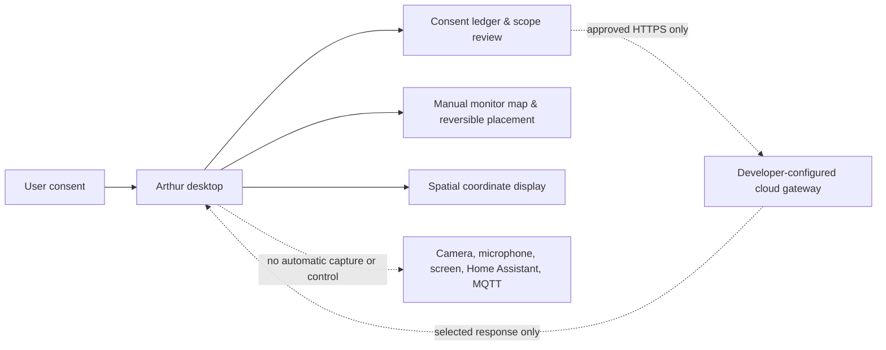

# Arthur: Cloud-Assisted, Low-Resource Operating Model

> **Default posture:** Arthur is a local Windows desktop application with a closed cloud boundary. A cloud route is an explicit, per-provider configuration—not a background fallback.



## Resource Boundary

| Layer | Runs where | Default state | Guardrail |
|---|---|---|---|
| Spatial layout and coordinate metadata | Windows desktop | Local | No continuous display or window polling |
| Monitor map and one window placement | Windows desktop | Manual review | Requires room unlock, a selected PID, preview, and confirmation |
| AI intelligence request | Approved cloud gateway | Closed | HTTPS only; named provider and explicit data class |
| Streaming | Future approved client | Off | Named session, bounded duration, stop control, retry backoff |
| Voice, vision, screen share, Home Assistant, MQTT | Local/provider adapters | Off | Separate consent and configuration for each adapter |

## Cloud Connection Checklist

1. Select one provider-neutral **HTTPS** gateway endpoint. Arthur blocks `http://`, `ws://`, and `wss://` from its standard cloud request path.
2. Store that provider’s developer-owned **API key** or **OAuth token** in the **Windows Credential Manager**. Do not place it in `app.py`, a JSON profile, Git, or the browser preview.
3. Declare the allowed data class, such as “approved text request only.” Camera, microphone, screen, files, notes, and health text remain excluded unless separately selected and approved.
4. Review scope before the first request. A future streaming connection additionally needs a client name, expiry, reconnection/backoff policy, and stop control.

## Optional Local Dependencies

The monitor review foundation uses `screeninfo` and `pywin32` only when you intentionally install them:

```powershell
pip install -r requirements-monitor-optional.txt
```

The command only installs optional desktop libraries. It does not map monitors, inspect processes, move windows, launch Arthur in the background, or connect to any cloud service.

## Recovery

The current source has no cloud connection to revoke. After a future connection exists, use the profile’s privacy lock and provider-disable control, revoke the provider credential in Windows Credential Manager, and remove the endpoint. Manual window placements remain one-off actions and do not create background rules.
