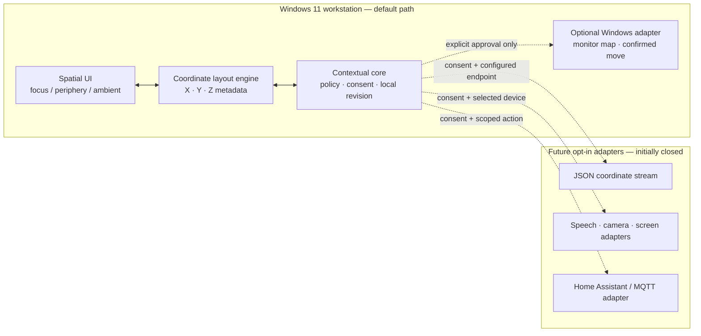

# Arthur Lightweight Coordinate Architecture

Arthur’s default deployment is a **local, bounded-revision workspace**. It stores only the current layout and a small local event record; it does not launch a server, connect a socket, access an input device, or send data to a provider. The desktop adapter uses optional Windows-native integrations only after the user has approved a specific action.

## Coordinate Contract

| Zone | Purpose | Typical modules | Placement rule |
| --- | --- | --- | --- |
| **Focus** | Active task that must be readable and actionable | approved editor, compiler/error status, urgent confirmation | nearest / highest Z |
| **Periphery** | Supporting operational context | system health, project tree, local planning trace | left or right / middle Z |
| **Ambient** | Background awareness that must not interrupt | calendar, weather placeholder, smart-home proposal, workstation state | behind task / lowest Z |

Every layout mutation will use a small JSON revision containing a module identifier, `x`, `y`, `z`, `zone`, revision number, and actor. The browser and desktop prototypes will render these revisions locally first. A future optional transport must authenticate before accepting them and must reject stale revisions.

## Future Transport Boundary

FastAPI supports WebSocket endpoints that explicitly accept a connection and can exchange JSON messages, which is appropriate for a **future** opt-in coordinate relay rather than a mandatory workspace dependency.[1] The proposed local server is consequently disabled by default, listens only after an explicit Start command, has a bounded message size and rate limit, and includes no cloud URL in the initial configuration.

Home Assistant’s WebSocket API uses JSON messages, begins with an authentication phase, and correlates later commands with caller-provided identifiers.[2] Arthur will therefore require a user-supplied local URL and long-lived access token before it can even validate a Home Assistant connection. MQTT remains an alternative adapter only when the user provides broker location, credentials, permitted topic prefix, and action allowlist. Neither adapter performs network discovery, subscribes to events, or calls a service automatically.

## Low-resource Choices

The workstation target is 8 GB RAM and approximately 2.4 GHz CPU. The foundation keeps the persistent desktop UI in PySide6, uses small immutable Python/TypeScript data structures for layout events, samples process resources only on an explicit diagnostic request, and avoids local language models, video pipelines, and continuous background loops. Cloud reasoning, speech engines, or vision analysis remain separately configured providers, not bundled workstation processes.

## Required Later Configuration

| Capability | Required before connection | What Arthur will not do beforehand |
| --- | --- | --- |
| Coordinate stream | explicit start, loopback/bound endpoint decision, authentication policy | open or publish a socket |
| Speech / camera / screen | separate user consent and selected device or capture target | access a device or send media |
| Home Assistant | HTTPS/local URL and long-lived access token | scan the LAN or list entities |
| MQTT | broker URL, TLS policy, credentials, topic prefix, action allowlist | connect, subscribe, or publish |
| Cloud AI | developer-controlled provider key and approved data scope | send prompts, audio, images, or screen content |

## References

[1]: https://fastapi.tiangolo.com/advanced/websockets/ "FastAPI WebSockets"
[2]: https://developers.home-assistant.io/docs/api/websocket/ "Home Assistant WebSocket API"
