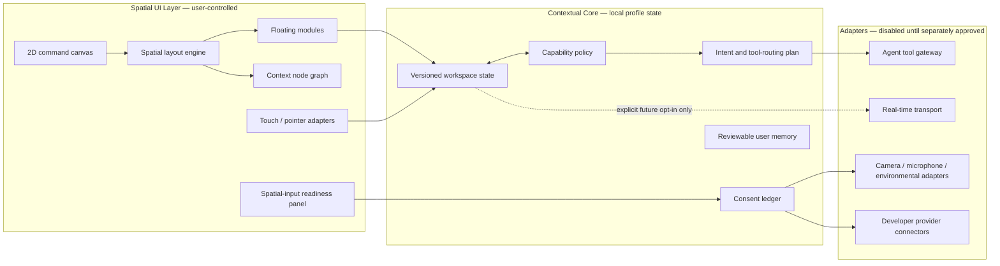

# Arthur Spatial Workspace Architecture

## Component Tree



Arthur’s next spatial-workspace foundation remains a **local visual orchestration surface**. It renders cards and a contextual node graph from local workspace state, while device capture, provider access, and continuous state streaming stay disabled unless they each receive their own reviewed, revocable approval.

## Layer Boundaries

| Layer | Responsibility | Current boundary |
|---|---|---|
| **Spatial UI** | Renders floating cards, node relationships, touch/pointer interactions, and accessibility fallbacks. | A 2D browser/desktop prototype; no headset, camera, or hand tracking is enabled. |
| **Contextual Core** | Holds workspace state, intent plans, visible audit events, consent decisions, and user-approved preferences. | Local-first simulated state only; no RAG corpus, ambient monitoring, or automated learning is activated. |
| **Adapter Gateway** | Defines narrow interfaces for future device, provider, and real-time transports. | All adapters are unavailable by default and require an explicit route and approval before any data is accessed or sent. |
| **Consent Ledger** | Records capability state, scope, purpose, and revoke action. | Enforces no implicit activation from rendering, selection, or profile completion. |

## Current Technology Decision

The browser implementation will use DOM-based spatial modules first because it keeps the existing desktop-like Arthur interface accessible, touch-friendly, and easy to validate. A later optional scene-renderer adapter can use React Three Fiber because its official documentation describes it as a React renderer for Three.js, with reusable interactive components that participate in React state while rendering outside React’s DOM reconciler.[1]

For any future multi-client synchronization, the design separates the state contract from its transport. Socket.IO is a viable optional adapter because it documents low-latency bidirectional event messaging with transport fallback, reconnection, acknowledgements, and scoped rooms; it is not interchangeable with a plain WebSocket server.[2] Arthur does **not** open such a connection in this implementation.

| Future delivery approach | Benefit | Trade-off | Current decision |
|---|---|---|---|
| **Local single-device workspace** | No network transport, lower privacy exposure, and works with the existing app model. | No shared live session across devices. | Implement now. |
| **Authorized real-time workspace session** | Can synchronize approved workspace changes across authenticated clients. | Requires persistent hosting, session access control, audit handling, and operational cost. | Document as a later opt-in adapter; do not enable now. |

## State Contract

Every visual change will be modeled as a small, versioned workspace event rather than direct camera or speech data. This makes a future real-time channel replaceable and keeps the state auditable.

```ts
type SpatialWorkspaceEvent = {
  id: string;
  revision: number;
  actor: "local-user" | "arthur";
  kind: "module.move" | "module.pin" | "module.discard" | "graph.focus";
  moduleId?: string;
  at: number;
};
```

The next implementation will accept only locally initiated workspace events. A later agent connector must expose a typed, permission-checked tool manifest and may never interpret a visual event as permission to access the microphone, camera, files, or another application. The Model Context Protocol is a suitable future reference for that boundary: its current specification describes JSON-RPC capability negotiation between host applications, connectors, and capability servers, and explicitly calls for user consent before data sharing or tool invocation.[3]

## References

[1]: https://r3f.docs.pmnd.rs/getting-started/introduction "React Three Fiber — Introduction"
[2]: https://socket.io/docs/v4/ "Socket.IO v4 — Introduction"
[3]: https://modelcontextprotocol.io/specification/2026-07-28 "Model Context Protocol — Specification (2026-07-28)"
